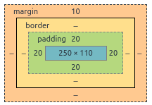

1. In pseudocode, write a function that takes an array of numbers, and returns another array that counts the number of times each number appears in the array.
``` 
declare function countNumbersInArray that takes an arraryOfNumbers as an argument
    Set a variable occurances as an empty array.
    loop over arrayOfNumbers from index zero to index -1
        if ArrayOfNumbers[i] is not in occurances[]
            occurances[arrayOfNumbers] = 1
        else if arrayOfNumbers[i] is in occurances
            occurances[arrayOfNumbers] =  occurances[arrayOfNumbers] + 1 
    end of loop
    return occurances
```


2. In pseudocode, write a function that takes two integers. For each integer in between those two numbers (inclusive), output 'fizz' if the number is even, 'buzz' if the number is divisible by 3, and 'baz' without 'fizz' or 'buzz' if the number is divisible by both.

```
function fizzbuzz (number1, number2) {

    // Check to see which number is lesser and which is greater.
    var lesserNumber;
    var greaterNumber;
    if (number1 < number2) {
        greaterNumber = number2;
        lesserNumber = number1;
    } else {
        greaterNumber = number1;
        lesserNumber = number2;
    }

    // Output fizz, buzz, or baz as appropriate
    for (i=lesserNumber, i <= greater number, i++) {
        if (i % 2 == 0 && i % 3 == 0 ) {
            output baz;
        } else {
                if (i % 2 == 0) {
                    output fizz;
                }
                if (i % 3 == 0) {
                    output buzz;
                }
        }
    }
}


// Alternate for loop structure.  Replace the for loop above with this one and it will get same result
for (let i = lesserNumber; i <= greaterNumber; i++) {
    let output = ""

    if (i is divisible by 2) {
            output = "fizz"
    }

    if (i is divisible by 3) {
            output = output + "buzz"
    }

    if (output = "fizzbuzz")
            output = "baz"
    }

    print output
 }

```


3. Given this css, draw a box model of the div.

        div { 
          width: 250px; 
          height: 110px; 
          margin-top: 10px; 
          padding: 20px; 
        }
